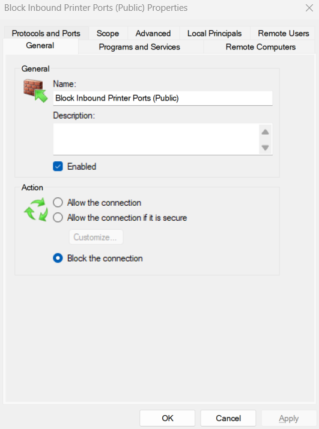
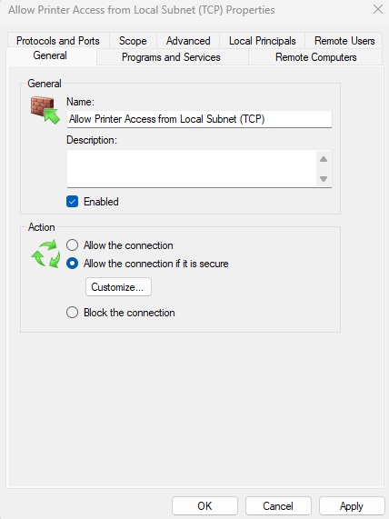

# 🔐 SOHO Printer Firewall Hardening 🔐
## 🧭 Purpose
This project documents a practical method for hardening network printers (e.g., HP OfficeJet Pro 8030) using Windows Defender Firewall (`wf.msc`). It focuses on restricting public exposure to commonly abused printer ports (e.g., 9100), while preserving internal network functionality and cloud connectivity via HP Smart.

> **Use Case**: Apply least privilege firewall rules to protect printers from Shodan-indexed threats, lateral movement, and firmware exploitation vectors.

---

## ⚙️ Setup Overview

### 🧩 Assumptions
- Printer is on a home network (e.g., `192.168.1.0/24`)
- Printer uses dynamic IP (or static reserved IP)
- Vendor printer software/app is installed (e.g., HP Smart, Epson Connect, Canon Print)
- Windows system is running Defender Firewall with `wf.msc`

---

## 🔧 Firewall Configuration Steps (via `wf.msc`)

### ✅ Step 1: Confirm Local Subnet
Use `ipconfig` to confirm the subnet, gateway, and device IP range:
```
IPv4 Address . . . . . : 192.168.1.x
Default Gateway . . . : 192.168.1.1
```
→ Network range: `192.168.1.0/24`

---

### 🚫 Step 2: Block Inbound Printer Ports (Public)

**Purpose**: Prevent unauthorized access via exposed services (e.g., RAW printing on port 9100)

1. Open `wf.msc` → Inbound Rules → New Rule
2. Select **Port**
3. Protocol: **TCP**
4. Ports: `9100, 515, 631`
5. Action: **Block the connection**
6. Profile: **Public only**
7. Name: `Block Inbound Printer Ports (Public)`

---



### ✅ Step 3: Allow Printer Access on Private Network

**Purpose**: Enable printing from local, trusted devices

1. Inbound Rules → New Rule → **Custom**
2. Program: **All programs**
3. Protocol: **TCP** | Ports: `9100, 515, 631`
4. Scope:
   - Local IP: Any
   - Remote IP: `192.168.1.0/24`
5. Action: **Allow**
6. Profile: **Private only**
7. Name: `Allow Printer Access from Local Subnet (TCP)`

---



### ✅ Step 4: Verify or Create Outbound Rule for Printer Software

**Purpose**: Ensure the vendor's print management software can reach cloud services for updates, diagnostics, firmware, or remote printing.

- Open `wf.msc` → Outbound Rules
- Look for an existing rule that allows outbound connections for your printer software (e.g., `HP Smart`, `Canon IJ Network`, `Epson Connect`, `Brother iPrint&Scan`)

#### 🔍 If a rule **already exists**:
- Ensure:
  - **Action** = Allow
  - **Profile** = All (or at least Private)
  - **Program** = Either the correct path or set to “Any”
- ✅ No further action is needed

#### ➕ If no rule exists:
1. Open PowerShell as Admin:
```powershell
Get-AppxPackage *printer* | Select-Object -ExpandProperty InstallLocation
```
(Replace `*printer*` with a more specific wildcard if needed, like `*epson*` or `*canon*`)

2. In `wf.msc` → Outbound Rules → New Rule
3. Rule Type: **Program**
4. Browse to the install path of your vendor’s print app
5. Action: **Allow**
6. Profile: **All**
7. Name: `Allow [Vendor] Printer Outbound`

---


### 🔐 Step 5: Block All Inbound to Printer (Public)

**Purpose**: Catch-all protection for the printer’s IP when on public networks

1. Inbound Rules → New Rule → **Custom**
2. Program: All programs
3. Protocol: Any
4. Scope:
   - Local IP: Printer IP (e.g., `192.168.1.100`)
   - Remote IP: Any
5. Action: **Block**
6. Profile: **Public only**
7. Name: `Block All Inbound to Printer (Public)`

---


## 🔍 Rule Comparison & Importance

| Rule                                   | Purpose                                           | Importance     |
|----------------------------------------|---------------------------------------------------|----------------|
| **Allow Inbound (Private)**            | Enable LAN printing/scanning                      | ✅ Necessary    |
| **Allow Outbound (Printer Software)**  | Enable cloud features, updates, diagnostics       | ✅ Helpful      |
| **Block Inbound Printer Ports (Public)**| Block known vulnerable ports from WAN            | 🔥 Critical     |
| **Block All Inbound to Printer (Public)** | Harden device IP from all untrusted exposure    | 🔥 **Most Critical** |

---

## ✅ Testing Checklist

- [ ] Can print and scan from local subnet
- [ ] Vendor app connects and updates printer info
- [ ] Printing fails from mobile hotspot (expected)
- [ ] Firmware and remote diagnostics still function

---

## 📎 Notes

- The `Block All Inbound to Printer (Public)` rule provides the strongest protection and should always be in place.
- Rules can be refined further with logging or strict IP filtering if needed.
- If you're using a non-Windows firewall (like on a router or endpoint protection suite), mirror the same logic.

---

## 🧠 Takeaway

Even consumer-grade printers can be vulnerable if exposed to the internet. A few custom rules in Windows Firewall go a long way in minimizing attack surface while preserving essential functionality.

