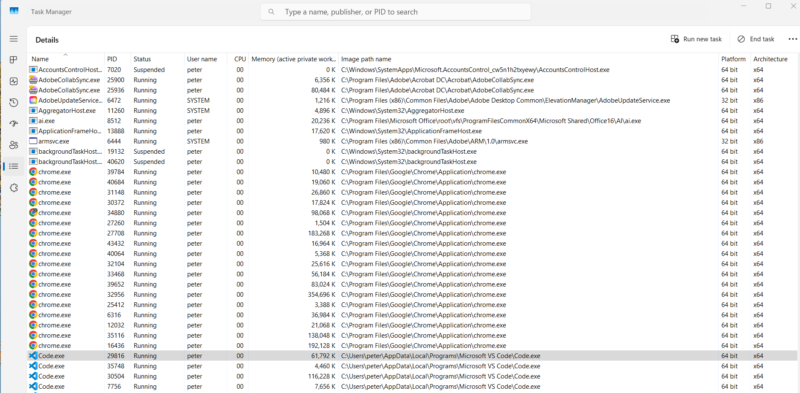
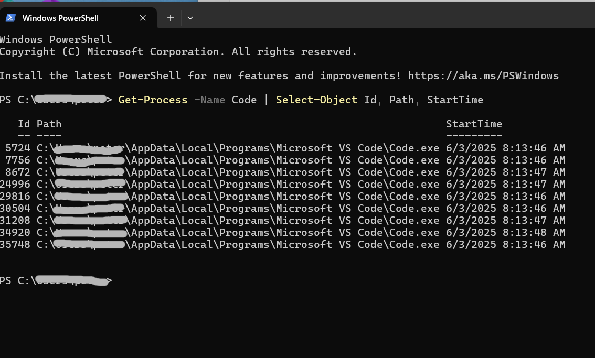
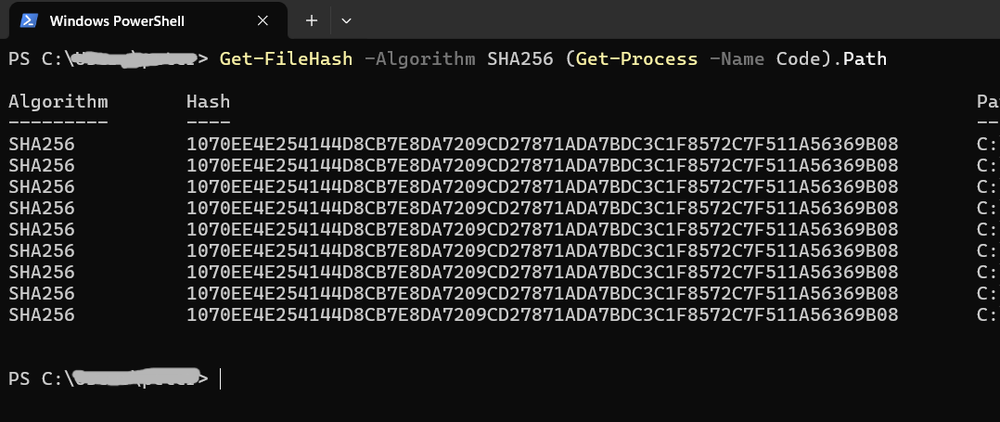
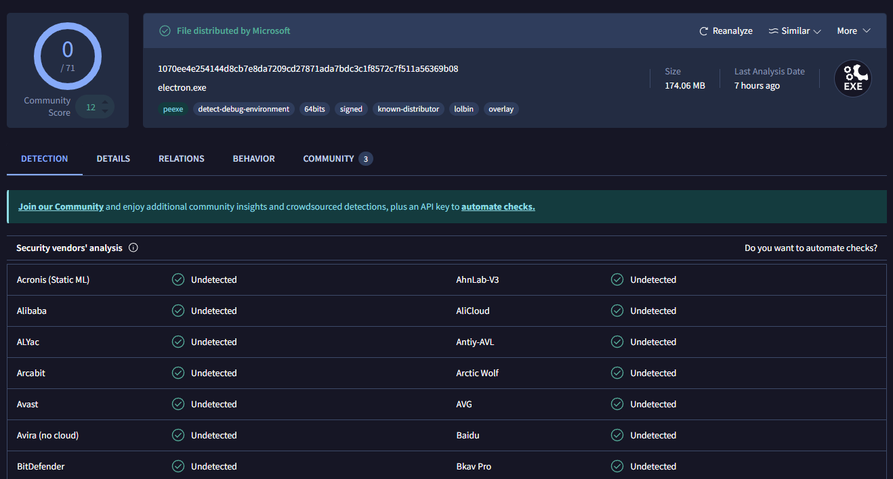
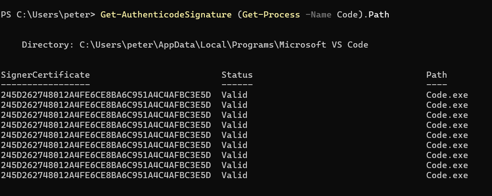
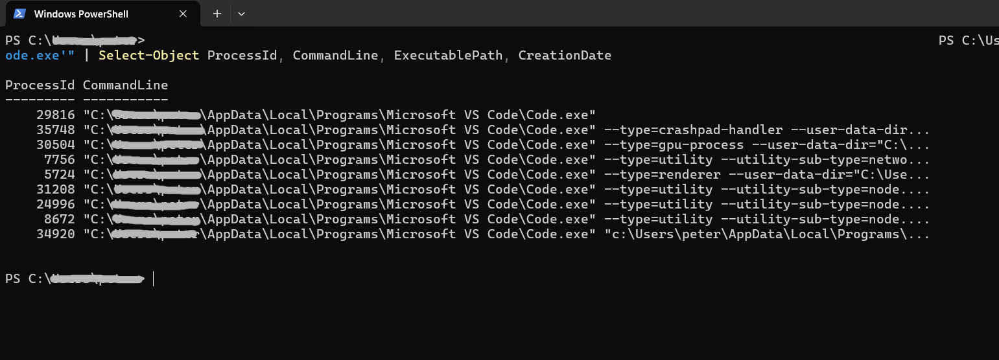

# 🛠️ Analyze and Investigate Suspicious Processes with PowerShell

This lab provides a hands-on walkthrough for identifying, analyzing, and investigating a potentially suspicious process on a Windows system. The process includes gathering metadata, validating the digital signature, computing a hash for online reputation checks, and, if needed, safely terminating the process.

## 📌 Objective

By the end of this lab, you'll be able to:

- Investigate running processes using PowerShell.
- Extract file paths and runtime details.
- Compute a file hash and submit it to VirusTotal.
- Inspect a file’s digital signature.
- Determine command-line arguments and execution location.
- Kill a process if necessary.

---

## 🔎 Identifying Suspicious Processes

If you're not starting with a known suspicious process, here's how to find one that might warrant investigation.

### 📊 Method 1: Use Task Manager (GUI)
1. Press `Ctrl + Shift + Esc` to open **Task Manager**.
2. Click the **Details** tab.
3. Look for:
   - Odd process names (see list of common suspicious processes below)
   - Processes with no listed publisher
   - Unusual CPU, memory, or disk usage
   - Executables running from user folders like `%APPDATA%` or `%TEMP%`

👉 **Tip:** In the **Details** tab of Task Manager, right-click any column header (e.g., "Name" or "PID") and select **"Select Columns"**. Then enable:
- `Image Path Name` to display the full file path (watch for suspicious locations like `%APPDATA%` or `%TEMP%`)
- `Publisher` to see the digital signature publisher, if available

---

### 🖥️ Method 2: Use PowerShell
You can also list all running processes and examine key details:
```powershell
Get-Process | Select-Object Name, Id, Path, StartTime
```

### 🚩 Examples of Potentially Suspicious Process Names

| Process Name    | Why It Might Be Suspicious                         |
|----------------|-----------------------------------------------------|
| `svch0st.exe`   | Spoof of `svchost.exe` with a zero instead of "o" |
| `lsasss.exe`    | Extra "s" — mimicking `lsass.exe`                 |
| `xrat.exe`      | Known RAT (Remote Access Trojan) variant          |
| `tor.exe`       | Tor client — benign use possible, but often abused|
| `update.exe`    | Generic name, commonly used in malware disguise   |
| `explorer.exe`  | Should only run from `C:\Windows\explorer.exe`    |

> 🧠 Once you've chosen a process, continue below to analyze it using PowerShell.

---

## 🧪 Lab Scenario

You've noticed a process named `Code.exe` running on your system. While it's likely tied to Visual Studio Code, it appears to be executing from the user-specific `%LocalAppData%` path. This lab will walk you through how to verify its legitimacy using native PowerShell tools.

> **Note:** You can replace `Code` with any real process name you wish to investigate.

---



---

## 🔍 1. Locate the File and Process Metadata

Use the `Get-Process` cmdlet to locate the file, identify its path, process ID, and when it started.

```powershell
Get-Process -Name Code | Select-Object Id, Path, StartTime
```

### ✅ Why This Matters:
- **Path**: Reveals where the executable resides — system folders (like `C:\Program Files`) are usually safe; user folders (like `AppData`) are more suspicious.
- **StartTime**: Unexpected launch times (e.g., right after startup) might warrant concern.
- **Process ID (PID)**: Needed for deeper inspection or termination later.

---



---

## 🧾 2. Get the File Hash for VirusTotal

Calculate the SHA-256 hash of the executable. This unique fingerprint can be queried on [VirusTotal](https://www.virustotal.com) to check if it's been flagged by antivirus engines.

```powershell
Get-FileHash -Algorithm SHA256 (Get-Process -Name Code).Path
```

### ✅ Why This Matters:
- **SHA-256 hash**: Allows anonymous reputation checking without uploading the file.
- This avoids alerting attackers in the case of live malware.

---



---

**➡️ Next step:** Copy the resulting hash and paste it into the VirusTotal search bar.

---



---

## 🧾 3. Inspect the Digital Signature

Examine the file's signature to determine if it's from a trusted vendor or unsigned.

```powershell
Get-AuthenticodeSignature (Get-Process -Name Code).Path
```

### ✅ What to Look For:
- **SignerCertificate**: Should show a known/trusted vendor (e.g., Microsoft, Adobe).
- **Status**: Should say `Valid`.

| Signature Status | Meaning |
|------------------|---------|
| Valid            | Trusted signature — likely safe |
| NotSigned        | No signature — suspicious |
| UnknownError     | Could not verify — suspicious |
| HashMismatch     | Tampered file — highly suspicious |

---



---

## 🧠 4. Show Detailed Process Information

For deeper context, use CIM to get command-line arguments, full execution path, and the creation timestamp.

```powershell
Get-CimInstance Win32_Process -Filter "Name = 'Code.exe'" | Select-Object ProcessId, CommandLine, ExecutablePath, CreationDate
```

### ✅ What to Look For:
- **CommandLine**: Suspicious parameters like `-enc`, `-nop`, `-w hidden` may indicate obfuscation or evasion.
- **ExecutablePath**: Should typically reside in `C:\Program Files\`. If it's located under `AppData`, `Temp`, or hidden folders, be cautious.
- **CreationDate**: Correlate with user activity or boot times.

---



---

## 🛡️ 5. Kill the Process (If Necessary)

If you determine the process is untrusted or malicious, stop it immediately.

```powershell
Stop-Process -Name Code -Force
```

### ✅ Follow-Up Action:
Now that the process is terminated:
- Navigate to the path retrieved earlier.
- Manually upload the file to VirusTotal for a full analysis.
- Optionally, quarantine or delete the file (after analysis).

---

## 📝 Summary

| Step | Action |
|------|--------|
| 1 | Identify and locate the process |
| 2 | Get file hash and check on VirusTotal |
| 3 | Verify digital signature |
| 4 | Analyze command-line arguments and path |
| 5 | Kill the process and upload to VirusTotal if needed |

---

## 🧠 Bonus Tips

- Use `tasklist /v` in CMD to view running tasks with window titles.
- Use `Sysinternals Process Explorer` for GUI-based inspection.
- Combine with `Get-MpThreat` and `Get-MpComputerStatus` for Defender context.

---

## 🔗 References

- [VirusTotal](https://www.virustotal.com)
- [Get-Process - Microsoft Docs](https://learn.microsoft.com/en-us/powershell/module/microsoft.powershell.management/get-process)
- [Get-FileHash - Microsoft Docs](https://learn.microsoft.com/en-us/powershell/module/microsoft.powershell.utility/get-filehash)
- [Get-AuthenticodeSignature - Microsoft Docs](https://learn.microsoft.com/en-us/powershell/module/microsoft.powershell.security/get-authenticodesignature)
- [Win32_Process WMI Class - Microsoft Docs](https://learn.microsoft.com/en-us/windows/win32/cimwin32prov/win32-process)

---

## 👨‍💻 Author

**Peter Van Rossum**  
Security Analyst & Researcher  
[GitHub: SecOpsPete](https://github.com/SecOpsPete)

---
````
